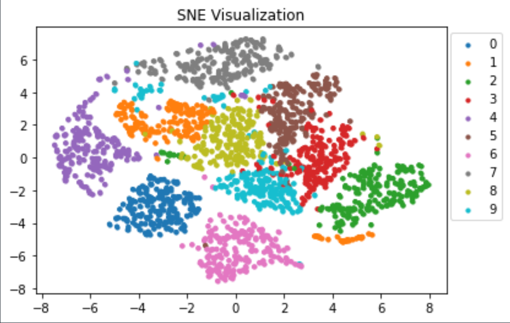
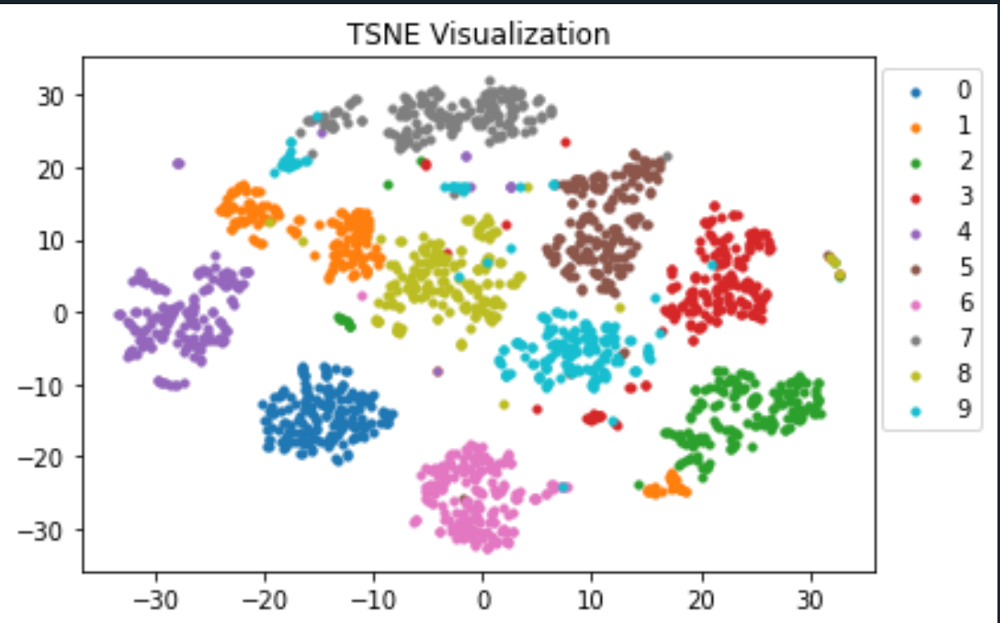

## Overview

This repository provides Python implementations of the SNE and t-SNE dimensionality reduction algorithms. The primary goal is to demonstrate 
the underlying mechanics of these techniques without relying on pre-built libraries like scikit-learn for the core logic. Both implementations 
are built using PyTorch, allowing for potential GPU acceleration.

## Features

* **SNE from Scratch:** A pure Python and PyTorch implementation of Stochastic Neighbor Embedding.
* **t-SNE from Scratch:** A pure Python and PyTorch implementation of t-distributed Stochastic Neighbor Embedding.

## Files

* `sne.py`: Contains the implementation for the SNE algorithm.
* `tsne.py`: Contains the implementation for the t-SNE algorithm.

## Dependencies

The code is built using Python and PyTorch. You will likely also need:

* **PyTorch:** `pip install torch`
* **NumPy:** `pip install numpy`
* **scikit-learn:** (Likely for generating or loading datasets, e.g., MNIST and for pca initialization) `pip install scikit-learn`
* **Matplotlib:** (For visualizing the results) `pip install matplotlib`

## Usage

    
    ```python
    from tsne import Tsne
    from sklearn.datasets import load_digits
   
    X, y = load_digits(return_X_y=True)
    sne = Tsne(n_components=2, perplexity=40)
    Y , final_loss = sne.fit_transform(X, n_iter=1000, lr=50)
    
    ```


## Results
  Results for handwritten digits dataset from sklearn are shown below
    
  
  

